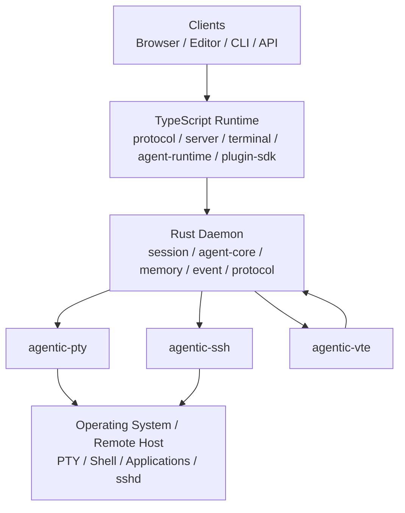
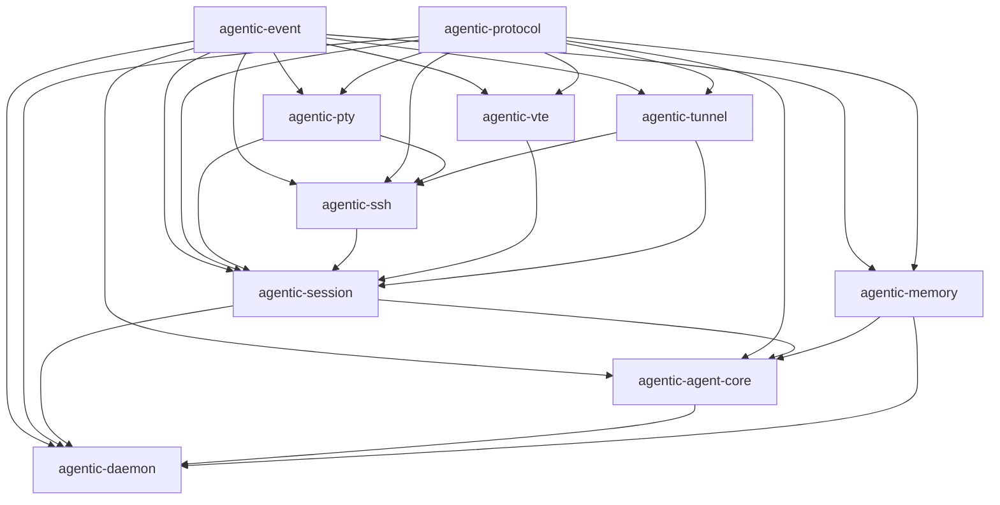

# agentic-native-stack

[](https://github.com/agentic-native/agentic-native-stack/actions)
[](https://www.rust-lang.org/)
[](https://nodejs.org/)
[](https://pnpm.io/)
[](#license)
[](agentic-native-stack.md)
[](#project-maturity)

<!--
Once the project has tagged releases, add:
[](https://github.com/agentic-native/agentic-native-stack/releases)
[](https://agentic-native.github.io/agentic-native-stack/)
-->

An agentic-native terminal execution stack built around a **Rust core** and a **TypeScript runtime layer**.

This project rebuilds the traditional terminal pipeline:

```text
Terminal Emulator → PTY → SSH → Network → sshd → PTY → Kernel TTY → Shell → Applications
```

as an agent-aware, permission-gated, observable execution fabric:

```text
Agent Surface
  → TypeScript Runtime
  → Rust Daemon
  → Session Multiplexer
  → PTY / SSH / Tunnel
  → Shell / Applications
  → Shadow VTE Parser
  → Structured Events
  → Agent Memory / Tools / Permissions
  → Audit / Telemetry / Observability
```

---

## Table of Contents

- [Architecture](#architecture)
- [Why?](#why)
- [Quick Start (5 Minutes)](#quick-start-5-minutes)
- [Project Maturity](#project-maturity)
- [Non-Goals](#non-goals)
- [Features at a Glance](#features-at-a-glance)
- [Highlights](#highlights)
- [Repository Layout](#repository-layout)
- [Workspace Dependency Diagram](#workspace-dependency-diagram)
- [Core Components](#core-components)
- [Design Principles](#design-principles)
- [Getting Started](#getting-started)
- [Example Agent Session](#example-agent-session)
- [Permission Model](#permission-model)
- [Event Model](#event-model)
- [Shell Integration](#shell-integration)
- [Security](#security)
- [Observability](#observability)
- [Deployment](#deployment)
- [Documentation](#documentation)
- [Architecture Decision Records](#architecture-decision-records)
- [FAQ](#faq)
- [Versioning Policy](#versioning-policy)
- [Contributing](#contributing)
- [Community](#community)
- [Roadmap](#roadmap)
- [Inspiration](#inspiration)
- [License](#license)

---

## Project Maturity

**Current stage:** architecture specification and implementation blueprints.

This repository currently contains:

- the full architecture specification,
- crate and package layout,
- protocol and event models,
- security and permission model,
- deployment and operations guidance,
- implementation blueprints for the Rust daemon and TypeScript runtime.

The project is **pre-1.0**. APIs, protocols, configuration formats, and crate boundaries may change before stabilization.

---

## Non-Goals

This project is **not**:

- a general-purpose terminal emulator intended to replace Alacritty, WezTerm, Kitty, or Ghostty as a daily GPU terminal;
- a shell replacement for bash, zsh, fish, or PowerShell;
- a model provider or LLM inference engine;
- a generic RPA system for GUI automation;
- a replacement for CI platforms such as GitHub Actions or GitLab CI;
- a production workflow engine for arbitrary business processes;
- a hosted SaaS product by itself, although it can be used to build one.

The focus is the **agent-native execution layer** between agents, terminals, shells, remote hosts, and auditable system actions.

---

## Why?

Traditional terminals are designed for humans. They render bytes as pixels, but they do not provide machines with safe, structured, permissioned access to shell execution.

Agents need more:

- machine-readable terminal events,
- command boundaries,
- exit codes,
- snapshot and replay,
- permission gates,
- audit trails,
- memory,
- tool execution,
- multi-session orchestration,
- remote execution over SSH,
- safe human oversight.

`agentic-native-stack` makes terminal sessions first-class agent objects.

---

## Quick Start (5 Minutes)

This quick start describes the intended developer workflow for the reference implementation.

### 1. Install prerequisites

```bash
# Rust
rustup update stable

# Node + pnpm
corepack enable
```

### 2. Build the workspace

```bash
cargo build --workspace
pnpm -C typescript/agentic-runtime install
pnpm -C typescript/agentic-runtime build
```

### 3. Start the daemon

```bash
cargo run --bin agentic-daemon -- --config config/dev.toml
```

### 4. Create and attach a session

```bash
agentic session new --shell /bin/zsh
agentic attach sess_01JZ...
```

### 5. Run an agent task

```bash
agentic run "Run echo hello and report the output"
```

---

## Features at a Glance

| Capability | Description | Primary Layer |
|---|---|---|
| PTY management | Cross-platform pseudo-terminal creation, resize, async drain | Rust |
| SSH execution | Client/server SSH channels, remote PTY, connection pooling | Rust |
| VTE parsing | Terminal escape parsing, grid state, shadow parser | Rust |
| Session multiplexing | Detachable sessions, panes, snapshots, reattachment | Rust |
| Agent runtime | Tool-calling agent loop, providers, orchestration | Rust + TypeScript |
| Permission engine | Policy evaluation, approval prompts, fail-closed behavior | Rust |
| Memory system | Episodic, semantic, procedural, graph memory, decay | Rust |
| Event system | Typed events, replay buffer, projections, audit stream | Rust |
| Terminal UI | xterm.js integration, annotations, rehydration | TypeScript |
| Plugin SDK | Tools, permission policies, decorators, memory sources | TypeScript |
| Workflows | Task graphs, approvals, retries, compensation | Rust + TypeScript |
| Observability | Logs, metrics, traces, recordings, forensic export | Rust + TypeScript |
| Multi-tenancy | Tenant isolation, quotas, metering, admin APIs | Rust + TypeScript |

---

## Highlights

- **Rust core** for PTY, SSH, VTE parsing, sessions, memory, events, and permissions.
- **TypeScript runtime** for server APIs, xterm.js terminal UI, agent orchestration, and plugins.
- **Shadow terminal parser** for server-side semantic understanding of terminal output.
- **Session multiplexer** inspired by terminal mux architectures.
- **Permission engine** with fail-closed behavior for high-risk actions.
- **Agent tool system** with schema validation and sandboxing hooks.
- **Graph-aware memory** with decay, provenance, and privacy controls.
- **Audit and recording** for replayable, inspectable agent sessions.
- **Multi-agent workflow engine** with task graphs, approvals, retries, and compensation.
- **Multi-tenant hosting model** with quotas, metering, and isolation guidance.

---

## Architecture

> The rendered image below is optional. If `docs/assets/architecture.png` does not exist yet, the Mermaid diagram and ASCII fallback describe the same architecture.




<details>
<summary>ASCII architecture diagram</summary>

```text
+--------------------------------------------------------------+
| Clients                                                      |
| - browser terminal                                           |
| - editor extension                                           |
| - CLI                                                        |
| - API client                                                 |
+-----------------------------+--------------------------------+
                              |
                              v
+-----------------------------+--------------------------------+
| TypeScript Runtime                                           |
| - @agentic/protocol                                          |
| - @agentic/server                                            |
| - @agentic/terminal                                          |
| - @agentic/agent-runtime                                     |
| - @agentic/plugin-sdk                                        |
+-----------------------------+--------------------------------+
                              |
                              v
+-----------------------------+--------------------------------+
| Rust Daemon                                                  |
| - agentic-session                                            |
| - agentic-agent-core                                         |
| - agentic-memory                                             |
| - agentic-event                                              |
| - agentic-protocol                                           |
+-------+----------------+----------------+--------------------+
        |                |                |
        v                v                v
+-------+----+    +------+-----+    +-----+------+
| agentic-pty|    | agentic-ssh|    | agentic-vte|
+------------+    +------------+    +------------+
        |                |                |
        v                v                v
+-------+----------------+----------------+--------------------+
| Operating System / Remote Host                               |
| - PTY devices                                                |
| - shells                                                     |
| - applications                                               |
| - sshd                                                       |
+--------------------------------------------------------------+
```

</details>

---

## Repository Layout

```text
agentic-native-stack/
  README.md
  LICENSE-MIT
  LICENSE-APACHE
  SECURITY.md
  CODE_OF_CONDUCT.md
  CONTRIBUTING.md
  agentic-native-stack.md

  docs/
    architecture.md
    security.md
    deployment.md
    shell-integration.md
    assets/
      architecture.png
    adr/
      README.md
      0001-rust-core.md
      0002-typescript-runtime.md
      0003-shadow-parser.md
      0004-permission-enforcement-in-rust.md
      0005-graph-memory.md

  rust/
    agentic-core/
      Cargo.toml
      crates/
        agentic-pty/
        agentic-ssh/
        agentic-vte/
        agentic-tunnel/
        agentic-session/
        agentic-agent-core/
        agentic-memory/
        agentic-event/
        agentic-protocol/
        agentic-daemon/

  typescript/
    agentic-runtime/
      package.json
      pnpm-workspace.yaml
      packages/
        protocol/
        server/
        terminal/
        agent-runtime/
        plugin-sdk/

  examples/
    cli-agent/
    web-terminal/
    ssh-gateway/
    ci-runner/

  scripts/
    build.sh
    test.sh
    bench.sh
    release.sh
```

---

## Workspace Dependency Diagram

### Rust Crate Dependencies



### TypeScript Package Dependencies

```mermaid
flowchart TD
    protocol[@agentic/protocol] --> server[@agentic/server]
    protocol --> terminal[@agentic/terminal]
    protocol --> runtime[@agentic/agent-runtime]
    protocol --> sdk[@agentic/plugin-sdk]
    server --> terminal
    runtime --> sdk
```

---

## Core Components

### Rust Crates

| Crate | Purpose |
|---|---|
| `agentic-pty` | Cross-platform PTY creation, process spawning, resize, async drain |
| `agentic-ssh` | SSH client/server, channels, authentication, connection pooling |
| `agentic-vte` | Terminal parsing, grid state, shadow parser, snapshots |
| `agentic-tunnel` | Transport abstraction over TCP, Unix sockets, WebSocket, QUIC |
| `agentic-session` | Session multiplexer, panes, attach/detach, snapshots |
| `agentic-agent-core` | Agent loop, tool dispatch, permissions, hooks, sub-agents |
| `agentic-memory` | Episodic, semantic, procedural, and graph memory |
| `agentic-event` | Typed event bus, replay buffer, projections |
| `agentic-protocol` | Shared identifiers, wire messages, schemas |
| `agentic-daemon` | Daemon executable hosting all services |

### TypeScript Packages

| Package | Purpose |
|---|---|
| `@agentic/protocol` | Shared message schemas and RPC types |
| `@agentic/server` | HTTP/WebSocket server and daemon bridge |
| `@agentic/terminal` | xterm.js terminal integration and rehydration |
| `@agentic/agent-runtime` | Agent orchestration, providers, tools |
| `@agentic/plugin-sdk` | Plugin API for tools, policies, decorators |

---

## Design Principles

1. **Rust owns safety-critical I/O.**  
   PTYs, SSH, process spawning, and permission enforcement live in Rust.

2. **TypeScript owns orchestration ergonomics.**  
   Plugins, server APIs, UI integration, and agent workflows are TypeScript-first.

3. **Terminal output is structured.**  
   Raw bytes are parsed into semantic events: commands, prompts, exits, errors, snapshots.

4. **Permissions are enforced fail-closed.**  
   Side-effecting tools require explicit permission decisions.

5. **Sessions are detachable and replayable.**  
   Sessions survive UI disconnects and can be rehydrated from snapshots.

6. **Agents are observable.**  
   Every tool call, permission request, and terminal event can be audited.

7. **Memory is evidence-linked.**  
   Memories carry provenance, confidence, privacy level, and decay.

8. **Humans remain in control.**  
   Approval workflows, diff review, and cancellation are first-class features.

---

## Getting Started

> The commands below describe the intended developer workflow for the reference implementation.

### Prerequisites

- Rust 1.82+
- Node.js 22+
- pnpm 9+
- Linux or macOS for PTY support
- Windows support planned via ConPTY

### Build

```bash
cargo build --workspace
```

```bash
cd typescript/agentic-runtime
pnpm install
pnpm build
```

### Run Tests

```bash
cargo test --workspace
```

```bash
pnpm -C typescript/agentic-runtime test
```

### Start the Daemon

```bash
cargo run --bin agentic-daemon -- --config config/dev.toml
```

### Create a Session

```bash
agentic session new --shell /bin/zsh
```

### Attach to a Session

```bash
agentic attach sess_01JZ...
```

### Run an Agent Task

```bash
agentic run "Run cargo test and summarize failures"
```

---

## Example Agent Session

```text
User:
  The tests in crates/agentic-ssh are failing.
  Find the failure and explain the root cause.

Agent:
  I will run cargo test to reproduce the failure.

Permission prompt:
  cargo test -p agentic-ssh

User:
  Approve once.

Agent:
  Tests failed with exit code 101.
  I will read crates/agentic-ssh/src/channel.rs.

Agent:
  The failure is caused by a missing channel state transition
  after EOF and exit status.

Evidence:
  - cargo test exit code 101
  - assertion failure in channel.rs
  - stale channel remains in connection map
```

---

## Permission Model

Permissions are evaluated before side-effecting operations.

Example policy:

```toml
[permissions]
default_policy = "ask"

[[permissions.rules]]
permission = "file_read"
decision = "allow"

[[permissions.rules]]
permission = "execute_tool"
tool = "shell_exec"
risk = ["high", "critical"]
decision = "ask"

[[permissions.rules]]
permission = "network_access"
resource = "host:169.254.169.254"
decision = "deny"
```

Permission decisions:

```text
allow
deny
ask
allow_once
allow_for_session
sandbox
```

---

## Event Model

The stack emits typed events for terminal, session, agent, permission, memory, and audit activity.

Example:

```json
{
  "eventId": "evt_01JZ...",
  "eventType": "pane.output",
  "eventVersion": 1,
  "timestampMs": 1769900000000,
  "source": {
    "component": "agentic-pty",
    "instanceId": "pane_01JZ..."
  },
  "sessionId": "sess_01JZ...",
  "payload": {
    "paneId": "pane_01JZ...",
    "sequence": 1025,
    "bytesBase64": "bHMgLWxhCg=="
  }
}
```

---

## Shell Integration

Shell integration provides command boundaries and exit codes using OSC markers.

Example markers:

```text
OSC 1337 ; AgenticCommandStart=cargo test BEL
OSC 1337 ; AgenticCommandEnd=0 BEL
```

Supported shells:

| Shell | Status |
|---|---|
| bash | supported |
| zsh | supported |
| fish | supported |
| PowerShell | partial |
| dash | limited |

---

## Security

Security is a first-class concern.

Key controls:

- Rust-side permission enforcement
- fail-closed policy evaluation
- secret redaction
- zeroizing buffers for credentials
- SSH host key verification
- sandboxed tool execution hooks
- append-only audit logs
- session recording with redaction
- tenant isolation guidance
- supply chain controls and SBOM guidance

Please read:

- [SECURITY.md](SECURITY.md)
- [docs/security.md](docs/security.md)

To report a security issue, please use the private security disclosure channel described in [SECURITY.md](SECURITY.md).

Do **not** open public issues for security vulnerabilities.

---

## Observability

The stack exports:

- structured logs,
- typed events,
- metrics,
- traces,
- audit records,
- session recordings.

Recommended metrics:

```text
agentic_sessions_active
agentic_panes_active
agentic_tool_invocations_total
agentic_permission_decisions_total
agentic_pty_bytes_read_total
agentic_event_bus_published_total
agentic_memory_entries_total
agentic_audit_queue_depth
```

---

## Deployment

The stack can be deployed as:

- a local CLI sidecar,
- a daemon for editor integration,
- a web terminal backend,
- an SSH agent gateway,
- a CI automation runner,
- a multi-tenant hosted control plane.

Example systemd unit:

```ini
[Unit]
Description=Agentic Native Stack Daemon
After=network.target

[Service]
Type=simple
ExecStart=/usr/local/bin/agentic-daemon --config /etc/agentic/config.toml
Restart=on-failure
User=agentic
Group=agentic
NoNewPrivileges=true
ProtectSystem=strict
ReadWritePaths=/var/lib/agentic

[Install]
WantedBy=default.target
```

---

## Documentation

The full specification is available in:

```text
agentic-native-stack.md
```

It includes:

- system architecture,
- Rust core design,
- TypeScript runtime design,
- data flow diagrams,
- protocol catalogs,
- security threat model,
- storage architecture,
- workflow engine,
- memory architecture,
- provider abstraction,
- tool system,
- terminal rendering,
- PTY and SSH deep dives,
- testing strategy,
- deployment and release engineering,
- governance and compliance,
- future directions.

---

## Architecture Decision Records

Important design decisions are recorded as ADRs under [docs/adr/](docs/adr/).

| ADR | Title |
|---|---|
| [ADR-0001](docs/adr/0001-rust-core.md) | Use Rust for core I/O and security boundaries |
| [ADR-0002](docs/adr/0002-typescript-runtime.md) | Use TypeScript for runtime orchestration and plugins |
| [ADR-0003](docs/adr/0003-shadow-parser.md) | Parse terminal output with a Rust-side shadow parser |
| [ADR-0004](docs/adr/0004-permission-enforcement-in-rust.md) | Enforce permissions authoritatively in Rust |
| [ADR-0005](docs/adr/0005-graph-memory.md) | Use graph-aware memory with decay and provenance |

---

## FAQ

### Why Rust + TypeScript?

Rust is used for safety-critical and performance-sensitive components: PTY management, SSH, terminal parsing, session multiplexing, permission enforcement, and audit storage. TypeScript is used for developer-facing orchestration: plugin SDK, xterm.js integration, HTTP/WebSocket server glue, editor and web UI integration, and agent workflow scripting.

This gives the project Rust-level safety and performance where it matters most, while keeping the extension and orchestration layer ergonomic.

### How does this differ from tmux?

`tmux` is a terminal multiplexer for humans. It manages windows, panes, and sessions. `agentic-native-stack` also multiplexes sessions, but its primary goal is to make sessions understandable and controllable by agents: structured terminal events, permission-gated tool execution, agent memory, audit logs, workflow orchestration, snapshot/rehydrate, and machine-readable command boundaries.

`tmux` can run inside this stack as a normal terminal application.

### How does this differ from WezTerm or Ghostty?

WezTerm and Ghostty are terminal emulators focused on rendering, input, GPU acceleration, and user experience. This project is not primarily a terminal emulator. It is an **agent-native execution stack** that may use terminal rendering surfaces such as xterm.js, editor panels, or CLI clients.

### Is this production ready?

Not yet. The project is currently in the specification and blueprint stage. The architecture is designed for production use, but implementations should be validated, tested, and security-reviewed before production deployment.

### Can I use only part of the stack?

Yes. The architecture is modular. For example, you could adopt only the PTY layer, VTE shadow parser, session multiplexer, permission model, event system, or TypeScript terminal runtime.

---

## Versioning Policy

This project follows [Semantic Versioning](https://semver.org/).

```text
MAJOR.MINOR.PATCH
```

- **MAJOR** changes may break APIs, protocols, configuration, or storage formats.
- **MINOR** changes add functionality in a backward-compatible way.
- **PATCH** changes contain backward-compatible fixes.

Before `1.0.0`, breaking changes may occur in minor releases.

The wire protocol includes an explicit version field:

```json
{
  "v": 1
}
```

Protocol changes follow compatibility rules documented in the full specification.

---

## Contributing

Contributions are welcome.

Please read:

- [CONTRIBUTING.md](CONTRIBUTING.md)
- [CODE_OF_CONDUCT.md](CODE_OF_CONDUCT.md)
- [SECURITY.md](SECURITY.md)

Basic workflow:

```bash
cargo fmt --all --check
cargo clippy --workspace -- -D warnings
cargo test --workspace
pnpm -C typescript/agentic-runtime lint
pnpm -C typescript/agentic-runtime typecheck
pnpm -C typescript/agentic-runtime test
```

Commit message convention:

```text
feat(pty): add ConPTY resize support
fix(ssh): close channel after exit status
docs(cookbook): add cargo test permission recipe
test(vte): add split UTF-8 regression test
```

---

## Community

- GitHub Issues: bug reports and feature requests
- GitHub Discussions: questions, ideas, and community support
- RFCs: major design proposals
- Security reports: private disclosure via [SECURITY.md](SECURITY.md)

---

## Roadmap

### Near-term

- Unix PTY implementation
- VTE shadow parser
- session multiplexer
- WebSocket terminal server
- xterm.js rehydration
- permission engine
- audit logging

### Medium-term

- SSH client/server integration
- plugin SDK
- workflow engine
- memory graph
- recording export
- multi-agent orchestration

### Long-term

- distributed agent scheduling
- formal verification of permission engine
- confidential execution
- plugin marketplace
- hosted multi-tenant control plane

---

## Inspiration

This project is informed by:

- WezTerm
- Alacritty
- russh
- AgentSSH
- Cersei SDK
- Claurst
- OpenCode
- Peri
- Lanterm
- Termic / libghostty patterns
- Omegon
- Abstract CLI

The goal is not to copy any one project, but to combine their strongest ideas into an agent-native terminal execution stack.

---

## License

Licensed under either of:

- Apache License, Version 2.0  
- MIT license

at your option.

```text
SPDX-License-Identifier: MIT OR Apache-2.0
```

See:

- [LICENSE-APACHE](LICENSE-APACHE)
- [LICENSE-MIT](LICENSE-MIT)
